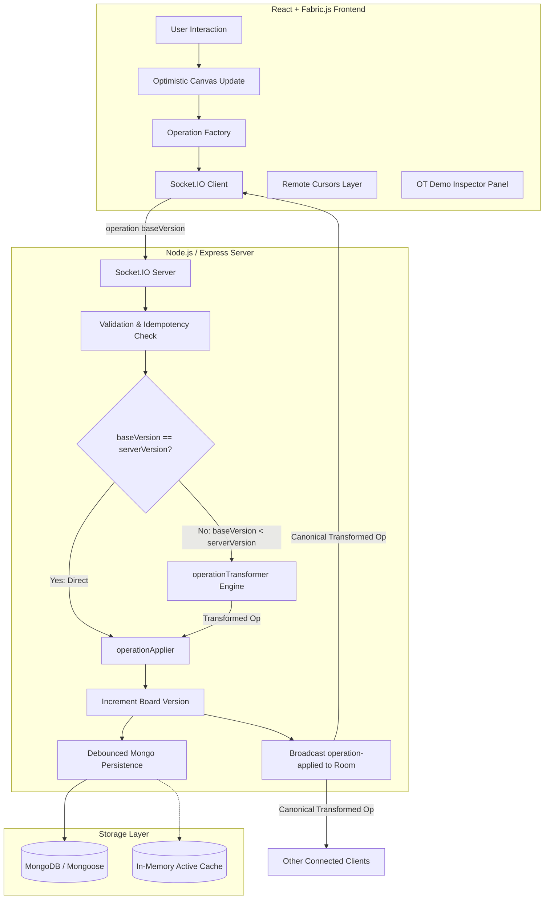

# Real-Time Multi-Party Whiteboard with Operational Transformation (OT)

> A polished, high-performance, real-time collaborative whiteboard built with React, Fabric.js, Node.js, Express, Socket.IO, and MongoDB, featuring a deterministic Operational Transformation (OT) conflict resolution engine for concurrent multi-user editing.

---

## How to explain this project to judges

> "The main challenge is concurrent editing. Multiple users can modify the same whiteboard at the same time. Instead of sending the entire canvas, we represent every action as an operation. Each operation contains a base version. The server maintains the authoritative version and transforms stale concurrent operations before applying them. This allows different users to collaborate in real time while maintaining a consistent shared state."

### Why WebSockets are used:
> "WebSockets provide a persistent bidirectional connection between clients and the server, allowing operations and cursor updates to be delivered with low latency."

---

## 1. Problem Statement

In multi-user collaborative environments like online whiteboards, multiple participants frequently perform actions simultaneously — such as moving the same diagram component, deleting an object while another user styles it, or concurrently drawing shapes.

Standard architectures that broadcast full canvas snapshots suffer from:
1. **Network Saturation:** Sending massive JSON blobs on every mouse event wastes bandwidth.
2. **Race Conditions:** Simultaneous writes overwrite each other (Last-Write-Wins), causing sudden visual jumps, desynchronization, and lost work.
3. **High Latency:** Waiting for central server locks freezes local user interactions.

---

## 2. Solution: Operational Transformation (OT)

This project resolves concurrent editing conflicts using a lightweight, deterministic **Operational Transformation (OT)** pipeline tailored for 2D canvas operations:

- **Granular Operation Model:** Clients emit minimal discrete operations (`ADD`, `MOVE`, `UPDATE`, `RESIZE`, `ROTATE`, `DELETE`, `TEXT_UPDATE`, `CLEAR`).
- **Optimistic UI:** Local actions render immediately on the client canvas, eliminating UI lag.
- **Server Transformation Pipeline:** If an incoming operation was based on an older board version (`baseVersion < serverVersion`), the server transforms the operation against intervening historical operations before committing it.
- **Additive & Deterministic Rules:** Concurrent moves combine additively (`dx`, `dy`), deletions take precedence over stale edits, and property updates merge without data loss.

---

## 3. Key Features

- 🎨 **Multi-Tool Whiteboard Canvas:**
  - Freehand Pen / Pencil with smooth bezier paths.
  - Shapes: Rectangle (with rounded corners), Circle, Line, and Arrowhead vector groups.
  - Interactive Text: Editable inline text (`IText`).
  - Selection, Multi-object manipulation, Moving, Scaling, and Rotation.
  - Object Eraser / Delete tool with keyboard shortcut (`Delete` / `Backspace`).
  - Live styling controls: Color palette, stroke width (Thin, Medium, Thick), and shape fill toggle.
- ⚡ **Real-Time Collaboration:**
  - Sub-millisecond latency Socket.IO event pipeline.
  - Broadcasts only transformed canonical operations (not canvas dumps).
- 🎯 **Live Remote Cursors & Presence:**
  - Throttled (30 updates/sec) smooth cursor tracking.
  - Each collaborator is assigned an avatar color with their name tag.
  - Online presence dropdown with real-time join/leave tracking.
- ↩️ **Inverse Operation Undo / Redo:**
  - Undo creates a new inverse operation (e.g. reverse displacement or restoration `ADD`) rather than rolling back the server database.
- 🧹 **Canonical Clear Board:**
  - Clear is an operation with highest precedence that resets canvas state uniformly for all connected peers.
- 🔗 **Instant Room Sharing:**
  - Unique board IDs (e.g., `/board/4c013d2d`).
  - One-click copy shareable link with clipboard feedback.
- 🛡️ **Resilient Persistence:**
  - Direct MongoDB storage via Mongoose.
  - Built-in In-Memory fallback mode: If MongoDB is unavailable or during local offline hackathon evaluations, the server automatically operates in-memory with zero crashes.
- 🧪 **Judge Demo Mode & Conflict Inspector:**
  - Dedicated interactive panel showing the live operation stream, version counters (`v15`), and transformation badges.
  - One-click **Concurrent Conflict Simulator** to demonstrate Rule 1 (MOVE + MOVE) and Rule 2 (MOVE + DELETE) live in front of hackathon judges!

---

## 4. Architecture



---

## 5. Technology Stack

| Layer | Technologies |
|---|---|
| **Frontend** | React 18, Vite, Fabric.js (v5), Tailwind CSS, Lucide Icons, Socket.IO Client, React Router DOM |
| **Backend** | Node.js (ES Modules), Express.js, Socket.IO (v4), Mongoose (v8) |
| **Database** | MongoDB (with auto-fallback to In-Memory resilient cache) |
| **Utilities** | UUID v4, CORS, Dotenv, Native Node Test Runner (`node:test`) |

---

## 6. How Real-Time Collaboration Works

1. **Room Partitioning:** Each whiteboard has a unique `boardId`. Socket.IO uses rooms (`socket.join(boardId)`) so operations are strictly scoped to collaborators on that board.
2. **Discrete Operations:** Instead of serializing the canvas JSON (which can be megabytes), the client emits small operation payloads (~150 bytes).
3. **Optimistic Rendering:** The user who initiates an action sees the shape move or render instantly.
4. **Canonical Broadcast:** The server processes the operation through the OT engine, increments the board version, and broadcasts `operation-applied`.
5. **Peer Canvas Update:** Other clients receive the operation and update only that specific object by `objectId`.

---

## 7. How Operational Transformation (OT) Works

Every operation carries a `baseVersion`, indicating the server version the client was synced with when the action was initiated:

```json
{
  "operationId": "09c91b5d-16f5-46f3-a178-0cb9333ce672",
  "boardId": "4c013d2d",
  "userId": "usr_7a10be2f",
  "type": "MOVE",
  "objectId": "shape_2b3f11",
  "payload": {
    "dx": 30,
    "dy": 0,
    "left": 230,
    "top": 150
  },
  "baseVersion": 12,
  "timestamp": 1727161800000
}
```

1. **Version Match (`baseVersion === serverVersion`):**
   - No concurrent operations occurred in between.
   - The operation is applied directly to the server board state.
   - Version increments to `serverVersion + 1`.
2. **Version Stale (`baseVersion < serverVersion`):**
   - Another user's operation committed on the server first.
   - The server retrieves all historical operations between `baseVersion` and the current version.
   - The server runs `transformAgainstHistory(incomingOp, historicalOps)` according to the OT conflict rules.
   - The transformed operation is applied and broadcast with `transformed: true`.

---

## 8. Deterministic OT Conflict Rules

### Rule 1: Concurrent MOVE + MOVE
- **Scenario:** User A moves `object1` by `dx=20, dy=0`. Concurrently, User B moves `object1` by `dx=0, dy=30`.
- **Resolution:** Movements are additive. When User B's operation is transformed against User A's operation, the resulting displacement combines both:
  $$\Delta x = 20 + 0 = 20, \quad \Delta y = 0 + 30 = 30$$
- Target coordinates are shifted by User A's displacement so both movements take effect smoothly.

### Rule 2: MOVE + DELETE
- **Scenario:** User A deletes an object while User B concurrently moves, resizes, or updates it.
- **Resolution:** **DELETE wins.** The incoming modification on the deleted object is transformed into a `NOOP` (`isNoOp: true`), preventing "ghost" objects from reappearing.

### Rule 3: DELETE + DELETE
- **Scenario:** User A and User B concurrently delete the same object.
- **Resolution:** The first delete is committed and removes the object. The second delete becomes an idempotent `NOOP`.

### Rule 4: UPDATE + UPDATE
- **Scenario:** User A changes `strokeWidth=4` while User B concurrently changes `fill="red"`.
- **Resolution:** Non-conflicting properties are merged (`strokeWidth=4, fill="red"`). If both update the exact same property concurrently, the server arrival sequence deterministically dictates the winning property.

### Rule 5: ADD + ADD
- **Scenario:** Two users draw shapes simultaneously.
- **Resolution:** Both objects are added to the canvas. Each object possesses a collision-free UUID.

### Rule 6: CLEAR Precedence
- **Scenario:** A user clears the board while another user has an in-flight operation targeting the old board version.
- **Resolution:** **CLEAR has highest priority.** Stale operations targeting the pre-cleared canvas are transformed into `NOOP`.

---

## 9. Database Design

### Board Model (`Board.js`)
```javascript
{
  boardId: { type: String, required: true, unique: true, index: true },
  name: { type: String, default: 'Untitled Board' },
  version: { type: Number, default: 0, min: 0 },
  objects: { type: [Schema.Types.Mixed], default: [] },
  createdAt: { type: Date, default: Date.now },
  updatedAt: { type: Date, default: Date.now }
}
```

### Operation Model (`Operation.js`)
```javascript
{
  operationId: { type: String, required: true, unique: true, index: true },
  boardId: { type: String, required: true, index: true },
  userId: { type: String, required: true },
  type: {
    type: String,
    enum: ['ADD', 'MOVE', 'UPDATE', 'RESIZE', 'ROTATE', 'DELETE', 'TEXT_UPDATE', 'CLEAR', 'NOOP']
  },
  objectId: { type: String },
  payload: { type: Schema.Types.Mixed, default: {} },
  baseVersion: { type: Number, required: true },
  serverVersion: { type: Number, required: true, index: true },
  transformed: { type: Boolean, default: false },
  timestamp: { type: Date, default: Date.now }
}
```

---

## 10. WebSocket Events

### Client $\rightarrow$ Server
| Event | Payload | Description |
|---|---|---|
| `join-board` | `{ boardId, user: { userId, displayName, color } }` | Join board room and request state |
| `leave-board` | `{ boardId, userId }` | Leave board room and cleanup presence |
| `operation` | `{ operationId, boardId, userId, type, objectId, payload, baseVersion }` | Submit candidate operation |
| `cursor-move` | `{ boardId, userId, x, y }` | Throttled live cursor position (30fps) |
| `request-board-state` | `{ boardId }` | Request full state snapshot |
| `undo` | `{ boardId, userId }` | Trigger inverse operation for user's last action |
| `redo` | `{ boardId, userId }` | Reapply last undone operation |

### Server $\rightarrow$ Client
| Event | Payload | Description |
|---|---|---|
| `board-state` | `{ boardId, name, version, objects, serverTime }` | Initial canvas state reconstruction |
| `operation-applied` | `{ operation, version }` | Canonical committed (and possibly transformed) operation |
| `operation-rejected` | `{ operationId, error, code, boardState }` | Operation validation or desync rejection |
| `cursor-update` | `{ userId, userName, color, x, y }` | Remote cursor position for other users |
| `user-joined` | `{ user, activeUsers }` | Notification when a collaborator joins |
| `user-left` | `{ userId, activeUsers }` | Notification when a collaborator leaves |
| `presence-update` | `{ activeUsers }` | Updated array of active room participants |
| `error` | `{ message }` | General socket error event |

---

## 11. REST API Endpoints

| Method | Endpoint | Description |
|---|---|---|
| `POST` | `/api/boards` | Create a new board (returns `{ boardId, name, version }`) |
| `GET` | `/api/boards/:boardId` | Get board state and objects |
| `GET` | `/api/boards/:boardId/operations` | Get operation history for OT inspection |
| `DELETE` | `/api/boards/:boardId` | Delete board |
| `GET` | `/api/health` | Health check & MongoDB / Memory connection status |

---

## 12. Installation & Quick Start

### Prerequisites
- Node.js (v18+ or v20+)
- npm (v9+)
- MongoDB (Optional: The application automatically falls back to an in-memory resilient cache if MongoDB is not running locally).

### 1. Clone & Setup

```bash
git clone <repository-url>
cd meetmuxprojecthack
```

### 2. Install Server & Client Dependencies

```bash
# Install server dependencies
cd server
npm install

# Install client dependencies
cd ../client
npm install
cd ..
```

---

## 13. Environment Variables

### Server (`server/.env`)
```ini
PORT=5000
CLIENT_URL=http://localhost:5173
MONGODB_URI=mongodb://127.0.0.1:27017/whiteboard_ot
NODE_ENV=development
```

### Client (`client/.env`)
```ini
VITE_SERVER_URL=http://localhost:5000
```

---

## 14. Running the Application

### Option A: Run Separately in Two Terminals

**Terminal 1 (Backend Server):**
```bash
cd server
npm run dev
# Server starts at http://localhost:5000
```

**Terminal 2 (Frontend Client):**
```bash
cd client
npm run dev
# Client starts at http://localhost:5173
```

### Option B: Run Concurrently from Project Root
```bash
npm run dev
```

---

## 15. Running MongoDB (Optional)

If you have MongoDB installed:
```bash
mongod --dbpath <path-to-db>
```
*Note: If MongoDB is not running, the server gracefully activates its **In-Memory Store** without crashing, allowing full collaboration, OT transformations, and room sharing.*

---

## 16. Testing the OT Engine

Run the automated test suite covering all 6 OT conflict rules, idempotency, inverse undo, and live WebSocket multi-client integration:

```bash
cd server
npm test
```

### Test Suite Output:
```text
▶ OT ENGINE UNIT TESTS
  ✔ Test 1: MOVE + MOVE -> additive movement (2.50ms)
  ✔ Test 2: MOVE + DELETE -> DELETE wins, MOVE becomes no-op (1.13ms)
  ✔ Test 3: DELETE + DELETE -> Second delete is NOOP (0.60ms)
  ✔ Test 4: UPDATE + UPDATE different properties -> merged (0.51ms)
  ✔ Test 5: UPDATE + UPDATE same property -> Server order wins (0.46ms)
  ✔ Test 6: ADD + ADD -> Both objects exist (0.42ms)
  ✔ Test 7: CLEAR + old operation -> Old operation ignored (0.46ms)
  ✔ Test 8: Duplicate operation idempotency (1.80ms)
  ✔ Test 9: Integration simulation of two clients collaborating with OT (0.88ms)
  ✔ Test 10: Undo creates inverse operation and restores state (1.75ms)
✔ OT ENGINE UNIT TESTS (15.86ms)
✔ LIVE WEBSOCKET & OT INTEGRATION TEST (1027.00ms)

ℹ tests 12 | pass 12 | fail 0
```

---

## 17. Demonstration for Hackathon Judges

To demonstrate the Operational Transformation engine to judges:

1. Open two browser windows side-by-side:
   - Window 1: `http://localhost:5173/` (Enter name: "Anchal", click "Create Whiteboard")
   - Window 2: Open the share URL in an Incognito window (Enter name: "Rahul")
2. Observe:
   - Real-time online presence in the top-right (`Online: 2` with avatars).
   - Moving your mouse in Window 1 renders a colored cursor labeled "Anchal" in Window 2 with zero lag.
3. Draw a rectangle with the **Pen** or **Rectangle** tool. It appears instantly in both windows.
4. Click the floating **"OT Inspector & Demo"** button at the bottom-right:
   - Displays current board version (`v14`).
   - Switch to the **"Conflict Simulator"** tab.
   - Click **"Test Rule 1: Concurrent MOVE + MOVE"**:
     - The simulator spawns an object, locks the base version, and fires two conflicting moves from simulated users Alice and Bob simultaneously.
     - The server OT engine intercepts Bob's operation, applies the additive vector transformation, and displays the conflict resolution badge live!
   - Click **"Test Rule 2: MOVE + DELETE"**:
     - Confirms `DELETE` takes precedence over concurrent modifications.

---

## 18. Future Improvements

- [ ] **Canvas Pan & Zoom:** Infinite canvas navigation via trackpad pinch-to-zoom and spacebar drag.
- [ ] **Image Uploads:** Drag-and-drop raster and SVG images directly onto the canvas.
- [ ] **Export Options:** One-click export to PNG, SVG, or PDF.
- [ ] **Audio/Video Chat:** WebRTC voice channels for synchronized remote meetings.
- [ ] **Object Locking:** Visual indicators when an object is being dragged by another peer.

---

## 19. Deployment Anywhere Guide

This repository is pre-configured for instant deployment on any cloud provider or container runtime.

### Option A: Fullstack Single Service (Render, Railway, Heroku, Fly.io, VPS)
In this mode, a single service runs the Node.js backend and automatically serves the pre-built React SPA from `client/dist`.

1. **Render.com**:
   - Push your repo to GitHub.
   - Go to **Render Dashboard** > **New Web Service** (or use Blueprint with `render.yaml`).
   - **Build Command**: `npm run postinstall && npm run build`
   - **Start Command**: `npm start`
   - **Environment Variables**:
     - `PORT`: `10000` (Render defaults to 10000)
     - `MONGODB_URI`: (Your MongoDB Atlas connection string, or omit for in-memory mode)

2. **Railway / Heroku**:
   - Connect the repository.
   - Railway and Heroku will automatically detect `Procfile` (`web: npm start`) and root `package.json`.
   - Add `MONGODB_URI` environment variable if using MongoDB.

---

### Option B: Docker Container (Any VPS, DigitalOcean, AWS, GCP)

Build and run anywhere with Docker:

```bash
# Build multi-stage image
docker build -t realtime-whiteboard .

# Run container
docker run -p 5000:5000 -e MONGODB_URI="mongodb+srv://..." realtime-whiteboard
```

Or run both the App and a local MongoDB instance with **Docker Compose**:
```bash
docker compose up -d
# App will be accessible at http://localhost:5000
```

---

### Option C: Split Deployment (Vercel/Netlify for Frontend + Render for Backend)

1. **Deploy Backend (Render / Railway / Fly.io)**:
   - Deploy as a Node.js web service. Note the backend URL (e.g., `https://whiteboard-api.onrender.com`).
   - Set `CLIENT_URL=https://your-frontend.vercel.app` in backend environment variables.

2. **Deploy Frontend (Vercel)**:
   - Import the repository in Vercel.
   - Pre-configured `vercel.json` will automatically build the client and route SPA pages.
   - Set Environment Variable in Vercel:
     - `VITE_SERVER_URL`: `https://whiteboard-api.onrender.com`
   - Deploy!

3. **Deploy Frontend (Netlify)**:
   - Import the repository in Netlify.
   - Pre-configured `netlify.toml` automatically builds from `client` and configures SPA redirects.
   - Set Environment Variable in Netlify:
     - `VITE_SERVER_URL`: `https://whiteboard-api.onrender.com`

---

## License

MIT License. Built with ❤️ for the Hackathon.
